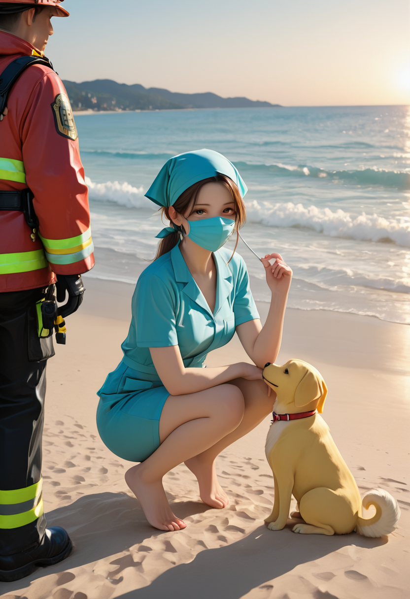
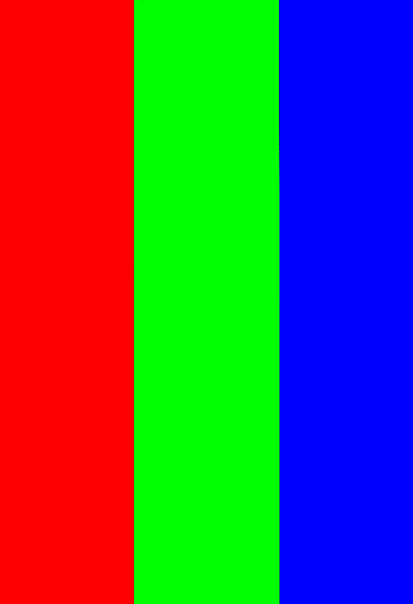

# MultiMaskCouple

MultiMaskCouple is a custom node for [ComfyUI](https://github.com/comfyanonymous/ComfyUI) which simplifies the process of masking your prompts, i.e. applying them to only part of the image. 
This makes it a lot easier to manage scenes with multiple distinct characters. You can also heavily influence pose and composition.

This project began as some minor improvements to [ComfyCouple](https://github.com/Danand/ComfyUI-ComfyCouple), but it's now pretty much its own separate thing.

## Installation

Clone this repo inside the custom_nodes directory in your ComfyUI install location.

## Features

- Arbitrary number of masks
- Any image resolution / aspect ratio
- Fast attention coupling
- Convenient interface

## Example

This image:

was made with this mask:

and a prompt like:

- Default: beach
- Red: man, space suit, standing
- Green: woman, scrubs, face mask, crouching
- Blue: dog, yellow labrador, laying

## Nodes

MaskedRegionCond is a convenience node to reduce the number of nodes that need to be connected. It's really just two ConditioningSetMask bundled together.

MultiMaskCouple is where the action is, it applies the masks and does a process called "attention coupling." 
I can't fully explain attention coupling, but basically it applies the prompts to the appropriate regions while also allowing them to interact and combine.

The nodes can be found in conditioning > MultiMaskCouple.

## Usage

It can seem a little complicated at first, but once you get it, it'll be fine. Here's a basic outline:

1. Create a mask image using pure RGB colors. I use [Photopea](http://photopea.com) for this, but any image editor is fine.
2. Load the masks using the built in "Load Image" and "Convert Image to Mask" nodes, one per color
3. For each mask, create a positive and negative prompt and CLIP encode them as normal
4. Feed each of those pairs, along with the mask, into a "MaskedRegionCond" node.
5. You will also need a default positive and default negative prompt, this is applied to any unmasked regions, and is also mixed in when strength < 1. It can be empty.
6. Connect all the outputs, along with the model, to the main "MultiMaskCouple" node.
7. The outputs of MultiMaskCouple hook into KSampler as normal.

## Tips and Notes

- *This process is not perfect*. It's kind of pushing the boundaries of what these models are designed to do. So while this is a powerful tool, it is not an automatic success every time, particularly with 3 or more masks.
- This is not strict masking. The regions can interact through the attention coupling process. This is a positive feature, but it can get in the way sometimes. Black regions can be useful for enforcing spacing.
- It can be a hassle to manage the intersection of the different prompts (what they have in common, like setting and camera angle). The string manipulation nodes like Concat can be used to make this more convenient.
- Keeping the masks simple is usually a good idea. Don't try to mask a detailed pose or outline, it won't work the way you'd like.
- Developing an intuition for how to design masks takes time and is tricky to explain. It's more about evoking the composition than dictating it. Experiment!
- Remember that the default mask is a fallback, not something applied globally. It will only be used in black regions or places where total strength < 1.
- Masks can overlap, which sometimes helps smooth interactions but also can increase bleed. Overlap the colors additively (i.e. red + green = yellow). 

This README is a work in progress. I'll write a more full-fledged guide soon.
