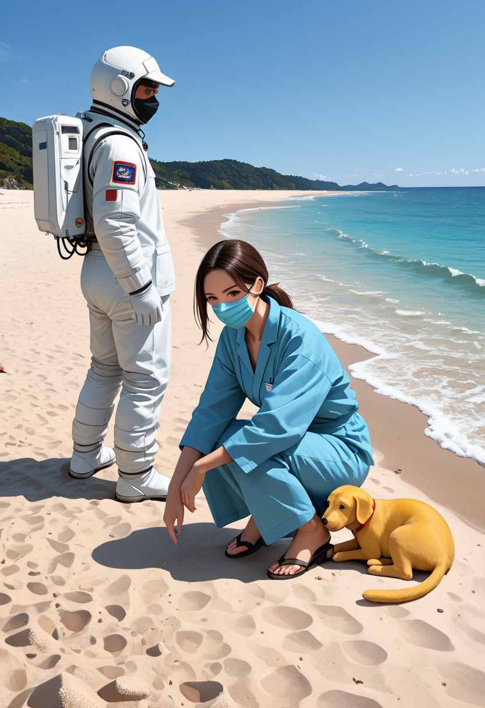
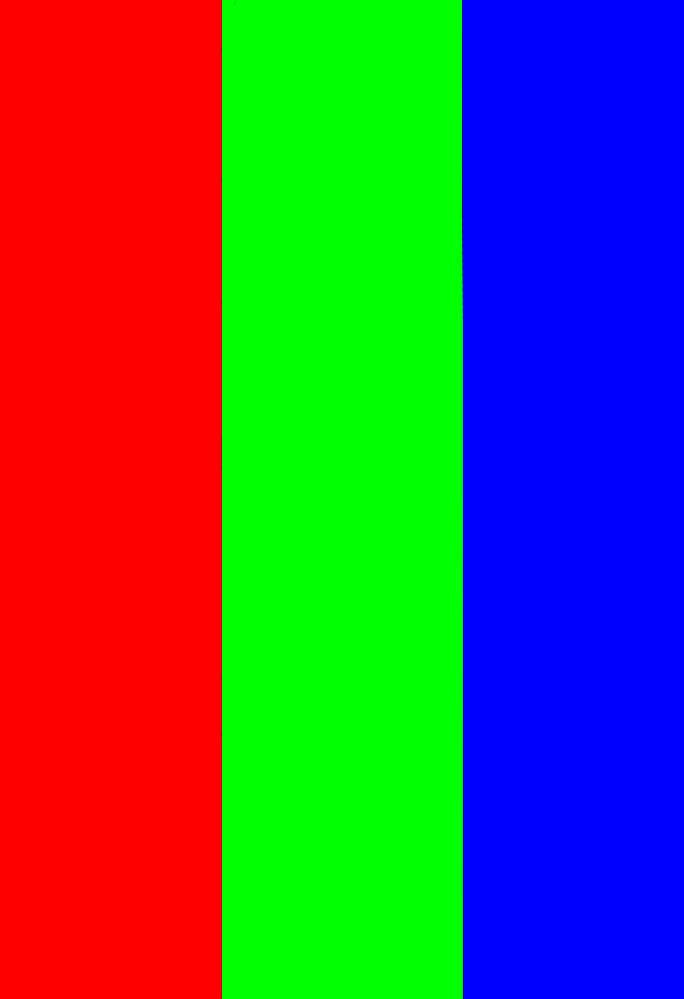

# MultiMaskCouple

MultiMaskCouple is a custom node for [ComfyUI](https://github.com/comfyanonymous/ComfyUI) which simplifies the process of masking multiple prompts, i.e. applying each to only part of the image. 
This makes it a lot easier to manage scenes with multiple distinct characters. You can also heavily influence pose and composition.

This project began as some minor improvements to [ComfyCouple](https://github.com/Danand/ComfyUI-ComfyCouple), but it's almost entirely rewritten at this point.

## Installation

Clone this repo inside the custom_nodes directory in your ComfyUI install location.

## Features

- Control multiple regions of one image
- Arbitrary number of masks
- Any image resolution / aspect ratio
- Fast attention coupling
- Convenient interface

## Nodes

MaskedRegionCond is a convenience node to reduce the number of nodes that need to be connected. It's really just two ConditioningSetMask bundled together.

MultiMaskCouple is where the core functionality is. It applies the masks and does a process called "attention coupling". 
I can't fully explain attention coupling, but basically it applies the prompts to the appropriate regions while also allowing them to interact and influence each other.

The nodes can be found in conditioning > MultiMaskCouple.

## Usage

It can seem a little complicated at first, but once you get it, it'll be fine. Here's a basic outline:

1. Create a mask image using pure RGB colors. I use [Photopea](http://photopea.com) for this, but any image editor is fine.
2. Load the masks using the built-in "Load Image" and "Convert Image to Mask" nodes, one per color.
3. For each mask, create a positive and negative prompt and CLIP encode them as normal.
4. Feed each of those pairs, along with the mask, into a "MaskedRegionCond" node.
5. Connect all the outputs, along with the model and CLIP, to a "MultiMaskCouple" node.
6. The outputs of MultiMaskCouple hook into KSampler as normal.

The included [Example Workflow](examples/masking-template.json) has an additional feature, a Global Positive String and a Global Negative String.
These are simply convenience fields which are appended to each regional prompt before encoding, so that you don't have to add or remove universal things, 
like the background or quality keywords, in more than one place.

## Example

This image:

was made with this mask:

and a prompt like:

Red: astronaut, standing

Blue: surgeon, woman, crouching

Green: yellow labrador, laying

Global Positive: beach, sand, sky, trio

Global Negative: bathing suit

## Tips and Notes

- *This process is not perfect*. It's kind of pushing the boundaries of what these models are designed to do. So while this is a powerful tool, it is not an automatic success every time, particularly with 3 or more masks.
- This is not strict masking or inpainting. The regions can interact through the attention coupling process. This is a positive feature, but it can get in the way sometimes. Small black borders can be useful for enforcing spacing.
- It can be a hassle to manage the intersection of the different prompts (what they have in common, like setting and camera angle). There is an example workflow included that demonstrates using the string concat node to make this more convenient.
- Keeping the masks simple is usually a good idea. Don't try to mask a detailed pose or outline, it won't work the way you'd like.
- Developing an intuition for how to design masks takes time and is tricky to explain. It's more about evoking the composition than dictating it. Experiment!
- Masks can overlap, which sometimes helps smooth interactions but also can increase bleed. Overlap the colors additively (i.e. red + green = yellow).
- To avoid issues, the mask image should be the same resolution as the output image.
